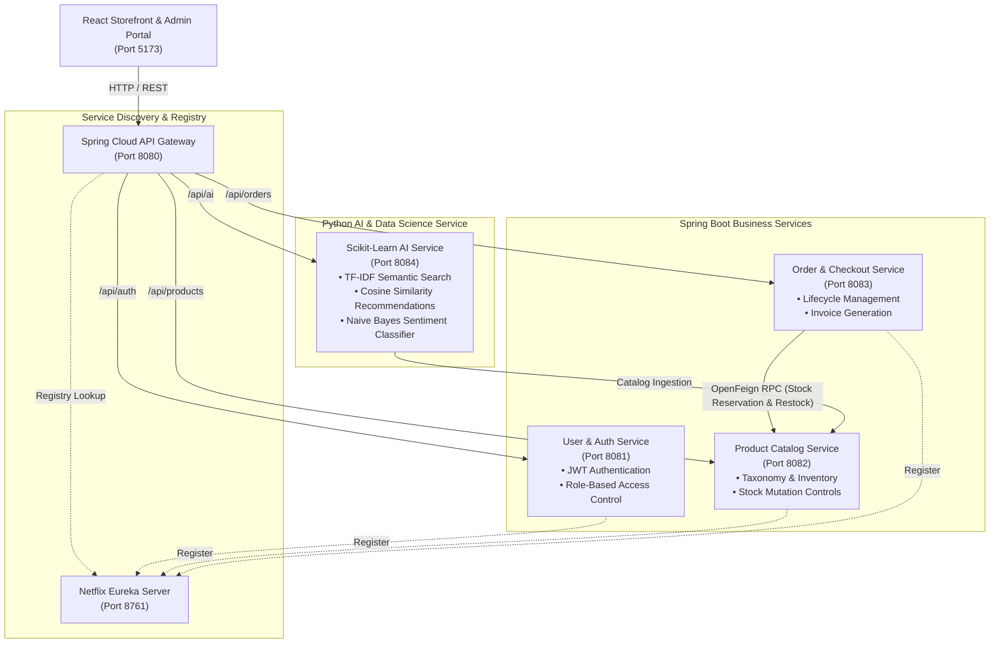

# NovaMart — Microservices & Machine Learning E-Commerce Platform

NovaMart is an end-to-end full-stack e-commerce system architected as a **polyglot microservices application**. The platform combines **Java 17 / Spring Boot 3** for transactional business domains, **Python / Scikit-Learn** for machine learning and recommendation services, and **React 18 / Vite / Tailwind CSS** for the customer storefront and administrative portal.

---

## 🏗️ System Architecture

All client traffic enters through a unified **Spring Cloud API Gateway** (`:8080`), which routes requests to backend services registered with **Netflix Eureka** (`:8761`). Synchronous inter-service communication (such as inventory deduction and restock compensation) is handled via **Spring Cloud OpenFeign**.



---

## 🛠️ Technology Stack

| Domain | Technologies | Rationale |
|---|---|---|
| **API Gateway** | Spring Cloud Gateway, Reactive Netty | Single entry point for routing, centralized CORS, and client decoupling. |
| **Service Discovery** | Spring Cloud Netflix Eureka | Dynamic service registration and client-side load balancing. |
| **Backend Services** | Java 17, Spring Boot 3.3.4, Spring Data JPA, Hibernate | Type-safe, production-ready framework for transactional domain logic. |
| **Inter-Service RPC** | Spring Cloud OpenFeign | Declarative HTTP client for synchronous inter-service communication. |
| **Authentication** | Spring Security, JJWT (io.jsonwebtoken), BCrypt | Stateless JWT Bearer token authentication with role-based access control. |
| **Database & Persistence** | In-Memory H2 Database (with Spring Data JPA) | Zero-friction local setup for immediate evaluation; swappable to PostgreSQL or MySQL via `application.properties`. |
| **Machine Learning Service** | Python 3.10+, FastAPI, Scikit-Learn, Pandas, NumPy, Uvicorn | Dedicated ML runtime leveraging Python's data science ecosystem. |
| **Frontend Application** | React 18, Vite, Tailwind CSS, Lucide Icons | Responsive Single Page Application (SPA) with modern state management. |

---

## ⚙️ Service Topology & Port Mapping

| Service Name | Directory | Port | Primary Responsibilities |
|---|---|:---:|---|
| **Discovery Service** | `backend/discovery-service` | `8761` | Netflix Eureka service registry and health status. |
| **API Gateway** | `backend/gateway-service` | `8080` | Reverse proxy, path routing (`/api/**`), and CORS management. |
| **User Service** | `backend/user-service` | `8081` | User registration, authentication, BCrypt password hashing, JWT generation. |
| **Product Service** | `backend/product-service` | `8082` | Product catalog, categories, inventory management, stock increment/decrement. |
| **Order Service** | `backend/order-service` | `8083` | Order creation, tax/discount calculation, OpenFeign stock reservation, cancellations, returns, and digital receipts. |
| **AI Microservice** | `backend/ai-service` | `8084` | TF-IDF recommendation engine, semantic search, review sentiment analysis, category predictor. |
| **Frontend Web App** | `frontend/` | `5173` | React storefront, cart/wishlist management, admin inventory and order dashboard. |

---

## 💡 Key Architectural & Engineering Decisions

### 1. Polyglot Microservices Separation
- **Java / Spring Boot** is assigned to transactional business workloads (users, products, orders) where strong typing, declarative transactions (`@Transactional`), and JPA entity relationships are critical.
- **Python / FastAPI** is assigned to machine learning workloads to leverage the Scikit-Learn ecosystem without burdening the JVM runtime with heavy mathematical libraries.

### 2. Distributed Order Lifecycle & Inventory Compensation
- **Order Placement**: When a customer places an order, `order-service` calls `product-service` via **OpenFeign** (`ProductClient`) to deduct stock units synchronously.
- **Pre-Shipment Cancellation**: Customers can cancel orders while in `PLACED`, `CONFIRMED`, or `PROCESSING` state. The order status updates to `CANCELLED`, payment is set to `REFUNDED`, and a compensating OpenFeign call replenishes the inventory back into `product-service`.
- **Post-Delivery Returns**: For orders in `DELIVERED` status, customers can submit a return request (`RETURN_REQUESTED`). Administrators review and approve the return in the Admin Dashboard, which executes the refund and automatically restocks the warehouse catalog.

### 3. Machine Learning Pipelines (Scikit-Learn)
- **Content-Based Recommendations (`recommender.py`)**:
  - Builds a composite text representation combining product title, category, and description.
  - Generates term vectors using `TfidfVectorizer(ngram_range=(1, 2), stop_words='english')`.
  - Calculates pairwise **Cosine Similarity** to return ranked similar products when viewing a product detail page.
- **Semantic Search (`/api/ai/search`)**:
  - Transforms search queries into the catalog TF-IDF vector space to match user intent and synonyms (e.g., query `"laptop"` matches `"UltraBook Zenith M3 OLED"` based on vector similarity).
- **Review Sentiment Analysis (`sentiment.py`)**:
  - Employs a Scikit-Learn `Pipeline` composed of `TfidfVectorizer` and `MultinomialNB(alpha=0.5)` to classify review texts into `POSITIVE`, `NEUTRAL`, or `NEGATIVE` with confidence probabilities.
- **Department Classifier (`category_predictor.py`)**:
  - Uses `LogisticRegression` to infer the appropriate store category from raw title and description text.

### 4. Zero-Friction Persistence (H2 In-Memory)
- Services use Spring Data JPA backed by H2 in-memory databases by default. This enables instant clone-and-run evaluation without requiring external database server setup or Docker containers.
- Data seeders (`DataInitializer`) populate realistic mock products, categories, and test accounts on startup.
- Production migration to MySQL or PostgreSQL requires only updating the JDBC driver and connection string in `application.properties`.

---

## 🚀 Getting Started

### Prerequisites
* **Java**: JDK 17 or higher
* **Maven**: 3.8+ (or use the included `backend/mvnw.cmd` / `backend/mvnw`)
* **Python**: 3.10+ with `pip`
* **Node.js**: 18+ with `npm`

---

### Quick Start (Automated PowerShell Script)

A master startup script is provided in `backend/` to launch all services in dependency order:

```powershell
# 1. Start all backend microservices
cd backend
./start-all.ps1

# 2. In a new terminal, start the React frontend
cd ../frontend
npm install
npm run dev
```

Open **`http://localhost:5173`** in your browser.

To stop all backend services cleanly:
```powershell
cd backend
./stop-all.ps1
```

---

### Manual Multi-Terminal Startup

If you prefer running services individually across terminals:

#### Step 1: Install Python AI Dependencies
```bash
cd backend/ai-service
pip install -r requirements.txt
```

#### Step 2: Build Java Microservices
```bash
cd backend
./mvnw clean package -DskipTests
```

#### Step 3: Launch Services in Order

| Terminal | Directory | Command | URL / Port |
|---|---|---|---|
| **Terminal 1** | `backend/discovery-service` | `java -jar target/discovery-service-1.0.0.jar` | `http://localhost:8761` |
| **Terminal 2** | `backend/user-service` | `java -jar target/user-service-1.0.0.jar` | `http://localhost:8081` |
| **Terminal 3** | `backend/product-service` | `java -jar target/product-service-1.0.0.jar` | `http://localhost:8082` |
| **Terminal 4** | `backend/order-service` | `java -jar target/order-service-1.0.0.jar` | `http://localhost:8083` |
| **Terminal 5** | `backend/ai-service` | `python main.py` | `http://localhost:8084` |
| **Terminal 6** | `backend/gateway-service` | `java -jar target/gateway-service-1.0.0.jar` | `http://localhost:8080` |
| **Terminal 7** | `frontend/` | `npm run dev` | `http://localhost:5173` |

*(Note: Wait ~8 seconds after starting Discovery Service before launching the remaining services).*

---

## 🔑 Pre-Configured Test Accounts

| Role | Email | Password | Permissions |
|---|---|---|---|
| **Customer** | `customer@novamart.com` | `password123` | Browse catalog, cart, wishlist, checkout, cancel orders, request returns. |
| **Administrator** | `admin@novamart.com` | `admin123` | Inventory stepper (+1, -1, custom), order status management, return & refund approval. |

*(New customer accounts can also be created via the registration modal on the storefront).*

---

## 📡 API Reference Overview

All client requests route through the API Gateway at `http://localhost:8080`:

### Authentication (`/api/auth/**`)
* `POST /api/auth/register` — Register a new customer account
* `POST /api/auth/login` — Authenticate credentials and receive Bearer JWT
* `GET  /api/auth/me` — Retrieve current authenticated user profile

### Product Catalog (`/api/products/**` & `/api/admin/products/**`)
* `GET   /api/products` — Search and filter products (query, category, price)
* `GET   /api/products/{id}` — Fetch product details by ID
* `GET   /api/products/featured` — Fetch spotlight products
* `POST  /api/admin/products` — Create a new product *(Admin)*
* `PUT   /api/admin/products/{id}` — Update product specifications *(Admin)*
* `PATCH /api/admin/products/{id}/stock` — Adjust inventory stock level *(Admin)*

### Orders & Checkout (`/api/orders/**` & `/api/admin/orders/**`)
* `POST /api/orders` — Submit new order and trigger stock reservation
* `GET  /api/orders/my-orders` — List authenticated user's order history
* `GET  /api/orders/{orderNumber}` — Retrieve order summary and invoice details
* `POST /api/orders/{id}/cancel` — Cancel order before shipping (triggers restock)
* `POST /api/orders/{id}/return` — Request return on delivered order
* `GET  /api/admin/orders` — List all orders across the system *(Admin)*
* `PUT  /api/admin/orders/{id}/status` — Update order status *(Admin)*
* `POST /api/admin/orders/{id}/refund` — Approve return and refund payment *(Admin)*

### Machine Learning (`/api/ai/**`)
* `GET  /api/ai/recommendations/{productId}` — Get top-N similar products (TF-IDF + Cosine Similarity)
* `GET  /api/ai/search?q={query}` — Semantic search with relevance scoring
* `POST /api/ai/analyze-sentiment` — Classify review sentiment (Multinomial Naive Bayes)
* `POST /api/ai/predict-category` — Predict product department from title & description

---

## 📁 Repository Structure

```
novamart/
├── README.md                           # Master system documentation
├── LICENSE                             # MIT License
├── .gitignore                          # Root ignore rules (Maven, Node, Python, IDE)
├── backend/
│   ├── pom.xml                         # Parent Maven project descriptor
│   ├── start-all.ps1                   # Automated startup script
│   ├── stop-all.ps1                    # Graceful shutdown script
│   ├── common-lib/                     # Shared DTOs, Enums, ApiResponse, JwtUtils
│   ├── discovery-service/              # Netflix Eureka Server (:8761)
│   ├── gateway-service/                # Spring Cloud API Gateway (:8080)
│   ├── user-service/                   # User management & JWT authentication (:8081)
│   ├── product-service/                # Product catalog & inventory (:8082)
│   ├── order-service/                  # Orders, payments, Feign RPC client (:8083)
│   └── ai-service/                     # Python FastAPI & Scikit-Learn service (:8084)
│       ├── main.py
│       ├── requirements.txt
│       └── models/
│           ├── recommender.py          # TF-IDF + Cosine Similarity
│           ├── sentiment.py            # Multinomial Naive Bayes Pipeline
│           └── category_predictor.py   # Logistic Regression
└── frontend/                           # React 18 + Vite Storefront (:5173)
    ├── package.json
    ├── vite.config.js
    └── src/
        ├── api/api.js                  # Axios client routed through Gateway
        ├── context/                    # Auth, Cart, Wishlist context providers
        ├── components/                 # Reusable UI components & modals
        └── pages/
            ├── customer/               # Storefront, PDP, Checkout, My Orders
            └── admin/                  # Inventory & Order Operations Dashboard
```

---

## 📄 License

This project is licensed under the [MIT License](LICENSE).
